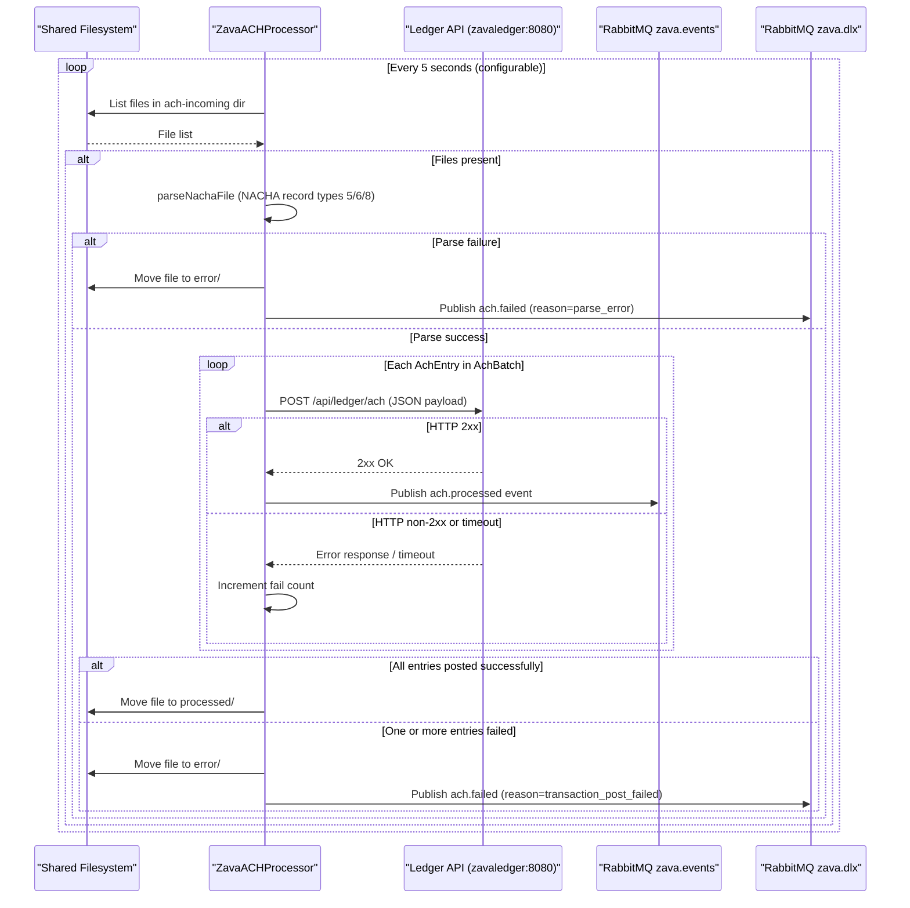

# API & Service Communication Contracts

ZavaACHProcessor exposes no inbound API surface; it operates as a headless batch consumer that issues one synchronous outbound REST call per ACH entry and two asynchronous event publications per processed file.

## Service Catalog

| Service | Port | Category | Purpose |
|---|---|---|---|
| ZavaACHProcessor | — (no listener) | Business | Polls a shared filesystem for NACHA ACH files, parses them, posts each entry to the Ledger API, and publishes domain events to RabbitMQ |
| Ledger API (`zavaledger`) | 8080 | Business (external) | Receives individual ACH transaction records via HTTP POST; owned by a downstream service |
| RabbitMQ Broker | 5672 (AMQP) | Infrastructure (external) | Message broker that receives `ach.processed` and `ach.failed` domain events |

## API Endpoints Inventory

ZavaACHProcessor has **no inbound HTTP endpoints**. It is a consumer-only service. The single outbound endpoint it calls is documented below for contract completeness.

| Direction | Method | Path | Request Type | Response Type | Notes |
|---|---|---|---|---|---|
| Outbound → Ledger | POST | `/api/ledger/ach` (configurable via `ledger.ach.endpoint`) | JSON body (inline — see DTOs section) | HTTP 2xx = success; non-2xx = failure logged and entry counted as failed | Base URL configurable via `ledger.url`; default `http://zavaledger:8080` |

## Management & Observability Endpoints

| Service | Endpoint | Custom Metrics |
|---|---|---|
| ZavaACHProcessor | None | None — no Actuator, health check, or metrics endpoint configured |

> Note: There are no liveness, readiness, or metrics endpoints. Cloud deployment platforms (AKS, App Service, Container Apps) will require these to be added for proper lifecycle management.

## DTOs & Contracts

The processor uses two **private inner classes** defined in `Main.java` as domain value objects:

- **`AchBatch`** — holds batch-header fields parsed from NACHA record type `5` (batch number, company name, effective date) and record type `8` (entry count, total debit/credit). Not serialized externally; used internally to carry parsed state across method calls.
- **`AchEntry`** — holds per-entry fields parsed from NACHA record type `6` (transaction code, routing number, account number, amount in cents, individual ID/name, trace number). Fields are serialized manually into a JSON string literal for the Ledger HTTP POST body.

**Ledger POST payload** (hand-crafted JSON, no serialization framework):
```
{
  "source": "ach",
  "fileName": "<nacha file name>",
  "batchNumber": "<batch number>",
  "routingNumber": "<ABA routing number>",
  "accountNumber": "<account number>",
  "amountCents": "<amount as fixed-width string>",
  "traceNumber": "<trace number>"
}
```

**`ach.processed` RabbitMQ event payload** (exchange: `zava.events`, routing key: `ach.processed`):
```
{
  "eventType": "ach.processed",
  "fileName": "...",
  "batchNumber": "...",
  "traceNumber": "...",
  "amountCents": "...",
  "processedAt": "<ISO-8601 timestamp>"
}
```

**`ach.failed` RabbitMQ event payload** (exchange: `zava.dlx`, routing key: `ach.failed`):
```
{
  "eventType": "ach.failed",
  "fileName": "...",
  "reason": "parse_error | transaction_post_failed",
  "failedAt": "<ISO-8601 timestamp>"
}
```

No OpenAPI/Swagger specification, `.proto` files, GraphQL schema, or JSON schema files are present. No Jackson, Gson, or other serialization framework is used; all JSON is assembled via string concatenation with a minimal `escape()` helper.

## Communication Patterns

**Synchronous (HTTP REST)**: The processor calls the Ledger API synchronously using `java.net.HttpURLConnection` with configurable connect and read timeouts (default 15 000 ms each, property `http.timeout.ms`). There is no retry logic, circuit breaker, or backpressure mechanism; a non-2xx response from the ledger causes the entire ACH file to be moved to the error directory.

**Asynchronous (AMQP / RabbitMQ)**: Processed and failed events are published to RabbitMQ topic exchanges using the `com.rabbitmq:amqp-client` library. A new `Connection` and `Channel` are created for every publish operation and closed immediately after — there is no connection pooling or channel reuse.

**Service discovery**: Services are addressed by hardcoded hostnames configured in `achprocessor.properties` (`rabbitmq.host=localhost`, `ledger.url=http://zavaledger:8080`). Environment-variable overrides (`RABBITMQ_HOST`, `LEDGER_URL`) provide runtime flexibility but there is no dynamic service discovery (Eureka, Consul, Kubernetes DNS, etc.).

**Resilience policies**: None. The processor has no retry policy, circuit breaker, bulkhead, or timeout escalation beyond the raw HTTP connect/read timeout. A single failed ledger POST causes the whole file to be routed to the error directory.

**Security posture**: No authentication or TLS is configured for either the outbound Ledger HTTP calls or the RabbitMQ connection. The Ledger API is called over plain HTTP. RabbitMQ credentials (`rabbitmq.username`, `rabbitmq.password`) default to `guest/guest` in the properties file. All communication is unauthenticated and unencrypted in the default configuration.

## Service Technology Matrix

| Service | Web Framework | Data Access | Discovery | Gateway | Health Checks | Cache | Metrics |
|---|---|---|---|---|---|---|---|
| ZavaACHProcessor | None (no HTTP listener) | None (filesystem I/O only) | None (hardcoded URLs) | None | None | None | None |
| Ledger API (external) | Unknown | Unknown | Unknown | N/A | Unknown | Unknown | Unknown |

## Service Communication Sequence


