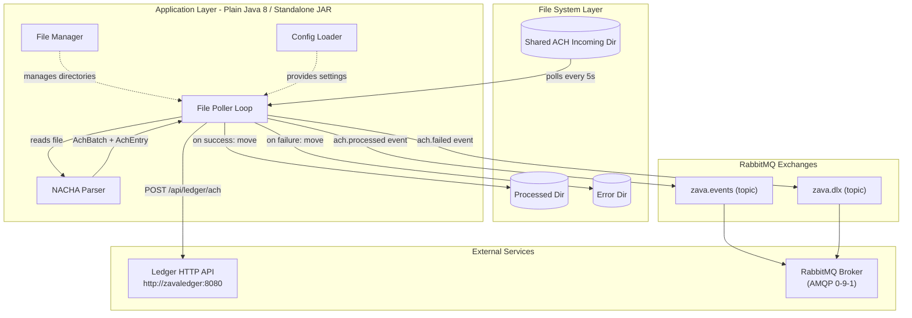
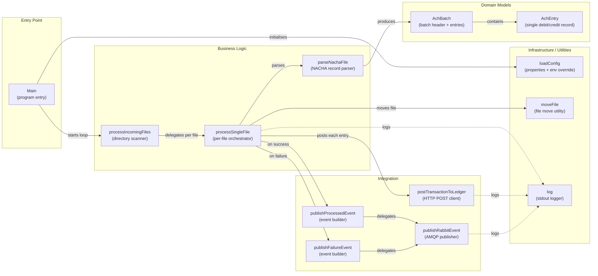

# Architecture Diagram

ZavaACHProcessor is a Java batch service that polls a shared filesystem for NACHA ACH files, parses each file, posts individual transactions to an HTTP ledger service, and publishes domain events to RabbitMQ.

## Application Architecture

### Technology Stack Summary

| Layer | Technology | Version | Purpose |
|---|---|---|---|
| Runtime | Java (OpenJDK) | 8 | Application runtime |
| Build Tool | Gradle + Shadow Plugin | 7.6 / 7.1.2 | Build and fat-JAR packaging |
| Messaging Client | RabbitMQ AMQP Client | 5.21.0 | Domain event publishing via AMQP |
| Database Driver | Microsoft SQL Server JDBC | 12.6.1 (jre8) | SQL Server connectivity (dependency declared, not used directly in current code) |
| Containerisation | Docker (multi-stage) | Gradle 7.6-jdk8 build / Eclipse Temurin 8-jre runtime | Container image creation |

### Data Storage & External Services

The application has no local database. Persistent state is maintained entirely through the file system: unprocessed files reside in a shared incoming directory (`/shared/ach-incoming`), successfully processed files are moved to a `processed/` subdirectory, and files that fail parsing or posting are moved to an `error/` subdirectory. Outbound integrations consist of two services: a Ledger HTTP API (`http://zavaledger:8080/api/ledger/ach`) that receives individual ACH transaction records via synchronous HTTP POST, and a RabbitMQ broker where processed-transaction events are published to the `zava.events` topic exchange and failure events to the `zava.dlx` dead-letter exchange.

### Key Architectural Decisions

- **Polling-based file ingestion**: The processor uses a configurable interval loop (default 5 s) to scan the incoming directory, avoiding the need for a message broker on the ingestion side while keeping the design simple.
- **Synchronous HTTP ledger integration**: Each ACH entry is posted synchronously to the ledger API before the file is moved; a single failure causes the entire file to be routed to the error directory and a `ach.failed` event published.
- **Event-driven result notification**: Both success and failure outcomes are broadcast as JSON messages over RabbitMQ topic exchanges, decoupling downstream consumers from the processor.

## Component Relationships

### Component Inventory

| Component | Layer | Type | Responsibility |
|---|---|---|---|
| Main | Entry Point | Application entry | Loads configuration, registers shutdown hook, starts polling loop |
| processIncomingFiles | Business Logic | Directory scanner | Lists files in the incoming directory and dispatches each to the per-file processor |
| processSingleFile | Business Logic | File orchestrator | Coordinates parsing, ledger posting, event publishing, and file routing for a single ACH file |
| parseNachaFile | Business Logic | NACHA parser | Reads fixed-width NACHA record types (5, 6, 8) and builds an AchBatch with AchEntry items |
| postTransactionToLedger | Integration | HTTP client | Sends a JSON-encoded ACH entry to the Ledger REST API via HTTP POST |
| publishProcessedEvent | Integration | Event builder | Constructs the `ach.processed` JSON event payload and delegates to publishRabbitEvent |
| publishFailureEvent | Integration | Event builder | Constructs the `ach.failed` JSON event payload and delegates to publishRabbitEvent |
| publishRabbitEvent | Integration | AMQP publisher | Creates a per-call RabbitMQ connection+channel, declares the exchange, and publishes the message |
| loadConfig | Infrastructure | Config loader | Reads properties file from classpath and applies environment-variable overrides |
| moveFile | Infrastructure | File utility | Moves a file from source to target path, creating parent directories as needed |
| log | Infrastructure | Logger | Writes timestamped messages to stdout |
| AchBatch | Domain Model | Value object | Holds batch-header fields and the list of AchEntry items parsed from a single NACHA file |
| AchEntry | Domain Model | Value object | Holds per-entry fields: transaction code, routing/account numbers, amount, trace number |
