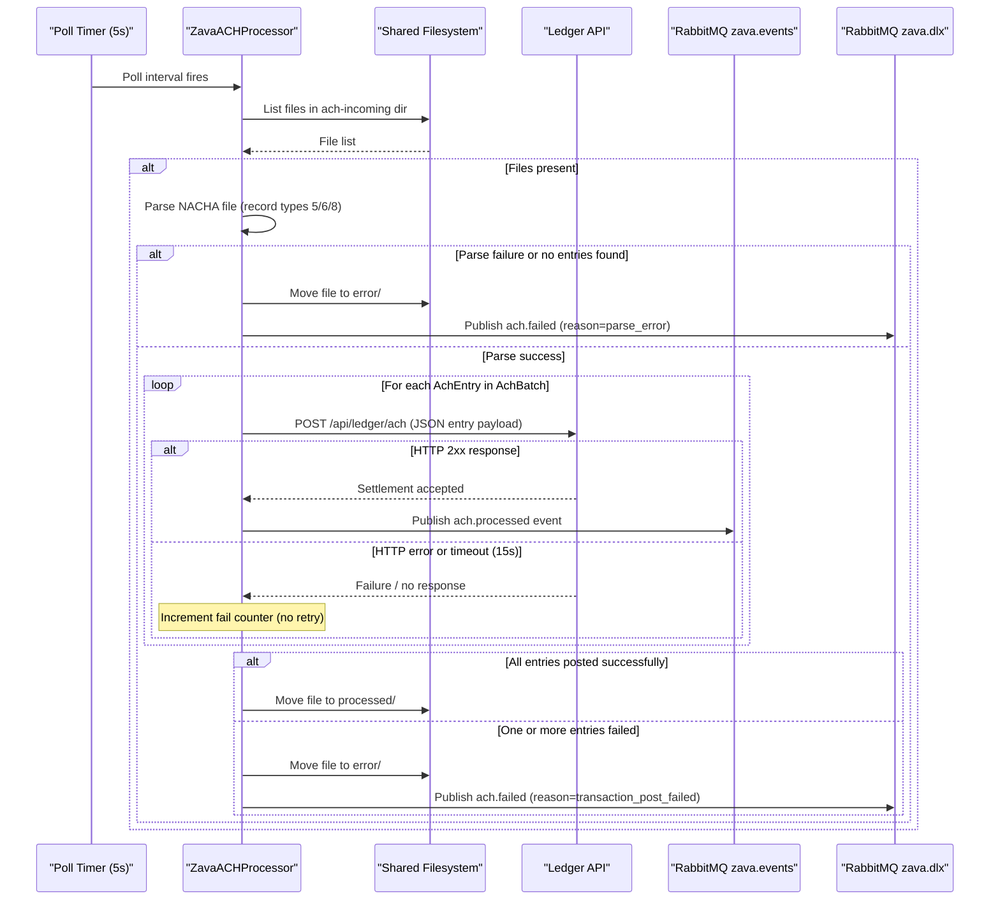

# Core Business Workflows

ZavaACHProcessor automates the ingestion and settlement of ACH (Automated Clearing House) payment batches in the ZavaBank ecosystem — it watches for incoming NACHA-format files, validates and parses each batch, posts every debit/credit entry to the ledger for real-money settlement, and emits domain events so downstream systems can react to outcomes.

## Domain Entities

| Entity | Service / Bounded Context | Description | Key Relationships |
|---|---|---|---|
| ACH File | ACH Processing | A NACHA-formatted fixed-width text file dropped into the incoming directory by an upstream system; represents one complete ACH batch submission | Contains one AchBatch header and one or more AchEntry records |
| AchBatch | ACH Processing | The batch-level header and control totals for a single ACH file; scoped to one file lifecycle | Aggregates all AchEntry items in the file; batch-level debit/credit totals must reconcile |
| AchEntry | ACH Processing | A single debit or credit instruction within a batch; corresponds to NACHA record type 6 | Belongs to exactly one AchBatch; independently posted to the Ledger service |
| Ledger Transaction | Ledger (external) | The settlement record created in the downstream Ledger service when an AchEntry is successfully posted | Created by the Ledger API in response to a POST from ZavaACHProcessor |
| ACH Domain Event | Event / Messaging | A JSON message published to RabbitMQ describing the outcome of a file or entry (processed or failed) | Produced by ZavaACHProcessor; consumed by downstream audit, notification, or reconciliation services |

## Service-to-Domain Mapping

| Service | Domain Context | Owned Entities | External Dependencies |
|---|---|---|---|
| ZavaACHProcessor | ACH Payment Processing | ACH File (filesystem), AchBatch (in-memory), AchEntry (in-memory) | Ledger API (HTTP POST — transaction settlement); RabbitMQ (event publication) |
| Ledger API (`zavaledger`) | Financial Ledger (external) | Ledger Transaction | None visible from this codebase |
| RabbitMQ | Event Infrastructure (external) | Domain events (`ach.processed`, `ach.failed`) | None |

## Primary Workflows

### Workflow 1: ACH File Batch Processing

**Trigger**: Polling timer fires (every 5 seconds by default) and finds one or more files in the incoming directory.

**Steps**:
1. **Directory scan** — The processor lists all files in the configured incoming directory. Non-file entries (subdirectories, the `processed` and `error` folders) are skipped.
2. **NACHA parsing** — Each file is opened and read line by line. Record type `5` (Batch Header) populates batch-level fields; record type `6` (Entry Detail) creates an `AchEntry` per line; record type `8` (Batch Control) captures totals. If no entries are found or an I/O exception occurs, the file is considered a parse failure.
3. **Parse failure path** — The file is moved to the error directory and an `ach.failed` event (reason: `parse_error`) is published to RabbitMQ.
4. **Per-entry ledger posting** — For each `AchEntry` in the batch, the processor synchronously POSTs a JSON payload to the Ledger API. Each post is independent; a failure on one entry does not abort posting of subsequent entries.
5. **Success path (all entries posted)** — If every entry returns HTTP 2xx, the file is moved to the processed directory.
6. **Partial/full failure path** — If any entry returns a non-2xx response or the HTTP call times out, the entire file is moved to the error directory and an `ach.failed` event (reason: `transaction_post_failed`) is published. No partial-success state exists — it is all-or-nothing at the file level.
7. **Success event publication** — For each successfully posted entry, an `ach.processed` event is published to the `zava.events` exchange.

### Workflow 2: ACH Failure Notification

**Trigger**: A file fails either at the parse stage or because one or more ledger posts fail.

**Steps**:
1. The file is routed to the error directory.
2. A single `ach.failed` event is published to the `zava.dlx` dead-letter exchange, carrying the file name and failure reason (`parse_error` or `transaction_post_failed`).
3. No automatic retry is performed; the file remains in the error directory until manually reprocessed or purged.
4. Downstream consumers of `zava.dlx` are responsible for alerting, reconciliation, or re-submission workflows.

## Cross-Service Data Flows

ZavaACHProcessor initiates all cross-service calls; no other service calls back into it.

**ACH Entry → Ledger settlement**: For every `AchEntry`, the processor extracts routing number, account number, amount in cents, trace number, batch number, and file name, then sends these as a flat JSON object to the Ledger API via HTTP POST. The Ledger service is the source of truth for transaction settlement; this processor is the source of truth for the NACHA file and its parsed content.

**Outcome → RabbitMQ events**: On success, the processor emits one `ach.processed` event per entry to `zava.events` (`ach.processed` routing key), carrying trace number, amount, batch number, file name, and a processing timestamp. On failure, one `ach.failed` event per file is emitted to `zava.dlx` (`ach.failed` routing key). Downstream consumers (reconciliation, audit, notifications) subscribe to these exchanges.

**Fallback behaviour**: If the Ledger API is unavailable (connection refused, timeout after 15 s), the entry is counted as failed. Once all entries are evaluated, if any failed, the entire file is moved to the error directory and a single failure event is emitted. There is no retry, circuit breaker, or dead-letter re-queue of individual ledger POSTs. If RabbitMQ is unavailable, the publish call logs an error but does not affect file routing — file movement is not transactionally coupled to event publication.

## Business Workflow Sequence



## Business Rules & Decision Logic

### Validation Rules

- **Non-empty entry set**: A NACHA file must contain at least one record-type-6 (Entry Detail) line. A file with zero entries is treated as a parse failure and routed to the error directory.
- **Record type dispatch**: Only record types `5`, `6`, and `8` are processed; all other record types are silently ignored. The parser does not enforce NACHA standard ordering of record types.
- **Field extraction by fixed position**: All NACHA field extraction uses fixed byte-position slicing (`safeSlice`). A line shorter than the expected field end position is handled gracefully by truncating to the available length.
- **No amount or routing validation**: The processor does not validate that routing numbers, account numbers, or amounts are in the correct format before posting to the ledger. Format validation is delegated to the Ledger API.

### Decision Logic

| Decision Point | Condition | Outcome |
|---|---|---|
| File skip | Entry is a directory named `processed` or `error` | Skipped without processing |
| Parse failure | Exception during file read, or zero entries extracted | File → `error/`; `ach.failed` event published |
| Entry post outcome | Ledger HTTP response code 2xx | Entry counted as success; `ach.processed` event published |
| Entry post outcome | Non-2xx or exception | Entry counted as failure; no event published for the entry |
| File routing after all entries | `failCount == 0` | File → `processed/` |
| File routing after all entries | `failCount > 0` | File → `error/`; single `ach.failed` event published |

### State Transitions

An ACH file passes through the following lifecycle states:

```
[In incoming dir] → (parse succeeds, all entries post) → [In processed dir]
[In incoming dir] → (parse fails)                       → [In error dir]
[In incoming dir] → (any entry post fails)              → [In error dir]
```

There is no intermediate or partial-success state. No retry is performed automatically once a file reaches the error directory.

### Cross-Cutting Concerns

- **Transactions**: No transactional boundary spans file movement and event publication. If RabbitMQ is unavailable after a successful ledger post, the event is lost; the file is still moved based on ledger results alone.
- **Error handling**: All exceptions within file processing are caught and logged to stdout; they do not propagate to the polling loop. A failure on one file does not prevent processing of subsequent files in the same poll cycle.
- **Logging**: All business events are logged to stdout via a plain `System.out.println` wrapper. There is no structured logging, correlation IDs, or log levels — all messages are emitted at a single implicit INFO level.
- **Authorization**: No authentication or authorization is enforced. Any process that can write to the incoming directory can inject ACH files for processing.
