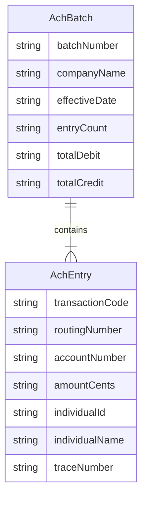

# Data Architecture & Persistence Layer

ZavaACHProcessor has no relational database or ORM layer in active use; all persistence is based on the shared filesystem, with two in-memory value objects (`AchBatch`, `AchEntry`) serving as transient parsing structures during file processing.

## Database Configuration

| Service / Module | DB Type | Profile | Driver | Connection | Migration Tool |
|---|---|---|---|---|---|
| ZavaACHProcessor | Filesystem | All | N/A | Shared directory paths configurable via properties / env vars | None |
| ZavaACHProcessor (declared, unused) | SQL Server | All | `mssql-jdbc 12.6.1.jre8` | Not configured in current code | None |

> Note: `mssql-jdbc` is declared as a compile-scope Gradle dependency but no SQL connection, `DataSource`, or JDBC call is present in the codebase. No schema management, migration tooling, or DDL configuration exists.

## Data Ownership per Service

| Service | Data Owned | ORM Framework | Caching | Notes |
|---|---|---|---|---|
| ZavaACHProcessor | Incoming ACH files, processed files, error files (filesystem directories) | None | None | Files are the exclusive persistence mechanism; directory paths are owned and managed by this service alone |

## Entity Model

The application has no JPA/Hibernate entities or database tables. The two inner classes below are in-memory parsing models only — they are not persisted to any external store.

> Note: These classes are private static inner classes within `Main.java`. They are instantiated per-file during parsing and discarded after each file is fully processed. They are never serialized to a database.

## Key Repository Methods

| Service | Repository | Notable Methods | Purpose |
|---|---|---|---|
| ZavaACHProcessor | None (no repository layer) | `parseNachaFile(File)` → `AchBatch` | Reads a NACHA fixed-width file and populates AchBatch/AchEntry in memory |
| ZavaACHProcessor | None | `moveFile(Path, Path)` | Moves a processed or failed file to the correct output directory — the only durable write operation |

## Caching Strategy

No caching layer is present. All data flows are stateless within a single file-processing cycle: files are read from disk, parsed into transient in-memory objects, and the objects are discarded once the file is moved. There are no repeated reads that would benefit from a cache, and no second-level or application-level cache is configured.

## Data Ownership Boundaries

ZavaACHProcessor is the sole owner of its filesystem directories (`ach-incoming`, `ach-incoming/processed`, `ach-incoming/error`). No other service is expected to write to these directories directly. Downstream systems receive information via two channels only: the synchronous Ledger HTTP POST (owned by the Ledger service) and the RabbitMQ event messages (owned by whatever consumers subscribe to `zava.events` and `zava.dlx`). There is no shared database between this processor and any other service.

Cross-service data access is strictly outbound: this service sends data to the Ledger API and to RabbitMQ — it never reads from a shared database or queries another service's data store.

### Data Classification & Sensitivity

| Field | Source | Classification | Controls in Place |
|---|---|---|---|
| `accountNumber` (AchEntry) | NACHA file, record type 6, positions 12-29 | PCI / PII — bank account number | None — stored in plain text on filesystem; transmitted in plain text over HTTP; no encryption-at-rest or in-transit |
| `routingNumber` (AchEntry) | NACHA file, record type 6, positions 3-11 | PCI — ABA routing number | None |
| `individualName` (AchEntry) | NACHA file, record type 6, positions 54-76 | PII — account holder name | None |
| `individualId` (AchEntry) | NACHA file, record type 6, positions 39-54 | PII — individual identifier | None |
| `amountCents` (AchEntry) | NACHA file, record type 6, positions 29-39 | PCI — financial transaction amount | None |
| `traceNumber` (AchEntry) | NACHA file, record type 6, positions 79-94 | Financial reference | None |

**Summary**: The application processes highly sensitive financial data (PCI — bank account/routing numbers, transaction amounts) and PII (individual names and identifiers). No encryption-at-rest is configured for the shared filesystem, no HTTPS/TLS is configured for the outbound Ledger HTTP call, no field masking is applied in logs, and no access controls restrict who may read the incoming or error directories.
