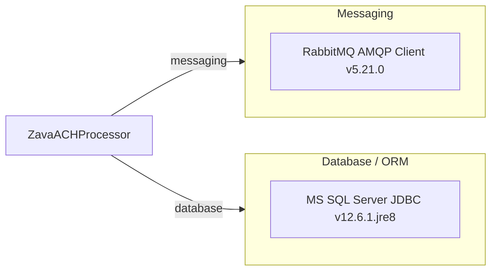

# Dependency Map

ZavaACHProcessor is a plain Java 8 standalone application with a minimal dependency footprint — 2 declared runtime dependencies managed by Gradle with the Shadow plugin for fat-JAR packaging.

## Dependencies

### Dependency Summary

| Category | Count | Key Libraries | Notes |
|---|---|---|---|
| Messaging | 1 | RabbitMQ AMQP Client 5.21.0 | Used for publishing `ach.processed` and `ach.failed` domain events to RabbitMQ topic exchanges |
| Database / ORM | 1 | Microsoft SQL Server JDBC 12.6.1.jre8 | Declared as a compile-scope dependency but not directly used in current source code; likely reserved for future ledger DB access |

### Version & Compatibility Risks

The application targets Java 8 (`sourceCompatibility = JavaVersion.VERSION_1_8`), which has reached end-of-life for most distributions. The Gradle wrapper uses version 7.6, which is compatible but ageing. The RabbitMQ AMQP Client 5.21.0 is a recent stable release with no immediate EOL concern, though it still depends on Java 8+ and should be re-evaluated when upgrading the runtime. The SQL Server JDBC driver 12.6.1.jre8 uses the jre8-specific artifact; migrating to a modern JDK would require switching to the `jre11` or later artifact variant. The Shadow plugin 7.1.2 is outdated and may not support newer Gradle APIs when the build is upgraded.

### Notable Observations

- **Java 8 EOL**: The entire build targets Java 8, which is end-of-life for community distributions. Migrating to Java 17 LTS or Java 21 LTS is strongly recommended before cloud deployment.
- **Unused JDBC dependency**: `mssql-jdbc` is declared in `build.gradle` but no `java.sql` or SQL Server API calls are present in the source. This suggests dead code, a work-in-progress feature, or a copy-paste artefact; it should be removed if not needed to reduce attack surface and image size.
- **No logging framework**: The application uses raw `System.out.println` wrapped in a `log()` method. A structured logging library (e.g., SLF4J + Logback) is absent, making log aggregation and filtering in cloud environments difficult.
- **Per-call RabbitMQ connections**: The AMQP client is used by creating a new `Connection` and `Channel` for every published event. This is a known anti-pattern; a shared connection with channel pooling should be considered for production workloads.

## Test Dependencies

No test-scope dependencies detected.

Total test-scope dependencies: 0

No test framework or test infrastructure dependencies are declared in `build.gradle`. The project currently has no unit, integration, or end-to-end tests configured via the build system.
