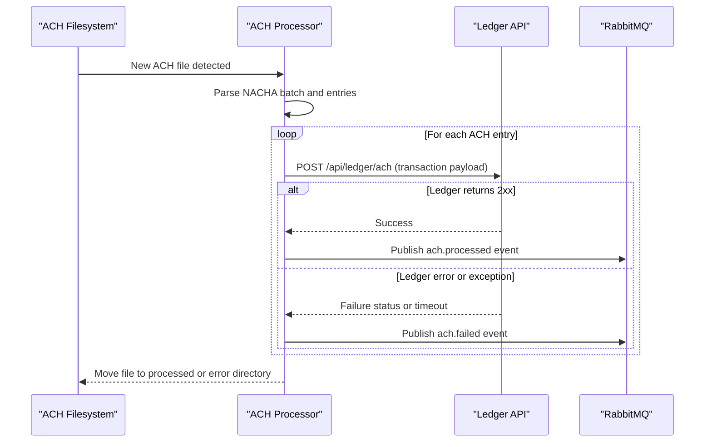

# API & Service Communication Contracts

The application exposes no inbound HTTP API and primarily communicates outbound to a ledger service and RabbitMQ using synchronous HTTP and asynchronous event publishing.

## Service Catalog

| Service | Port | Category | Purpose |
|---|---|---|---|
| mnm-ZavaACHProcessor | N/A | Business | Polls ACH files, parses entries, posts to ledger, emits events |
| zava-ledger (external) | 8080 (configured URL) | API Layer | Receives posted ACH transaction records |
| RabbitMQ (external) | 5672 | Infrastructure | Receives processed and failed ACH events |

## API Endpoints Inventory

| Service | Method | Path | Request Type | Response Type |
|---|---|---|---|---|
| zava-ledger (external call) | POST | `/api/ledger/ach` (default) | JSON payload (source, fileName, batchNumber, routingNumber, accountNumber, amountCents, traceNumber) | HTTP status code (2xx success) |

## Management & Observability Endpoints

| Service | Endpoint | Custom Metrics (if any) |
|---|---|---|
| mnm-ZavaACHProcessor | None detected | None detected |

## DTOs & Contracts

The processor uses inline JSON contracts rather than dedicated DTO classes. The outbound ledger request is composed in `postTransactionToLedger`, while event contracts for `ach.processed` and `ach.failed` are composed in `publishProcessedEvent` and `publishFailureEvent` respectively. No OpenAPI, protobuf, or GraphQL schema files were detected.

## Communication Patterns

Communication is mixed synchronous and asynchronous. For each parsed entry, the service synchronously posts to the ledger endpoint over HTTP. When successful, an `ach.processed` event is published; parsing or posting failures produce `ach.failed` events through a dead-letter exchange routing key. No circuit breaker or retry framework is implemented; failures are handled by logging and file routing to the error folder. No API-level authentication or TLS configuration is present in this codebase.

## Service Technology Matrix

| Service | Web | Data Access | Discovery | Gateway | Actuator | Cache | Metrics |
|---|---|---|---|---|---|---|---|
| mnm-ZavaACHProcessor | None | Filesystem IO | None | No | No | No | No |

## Service Communication Sequence

