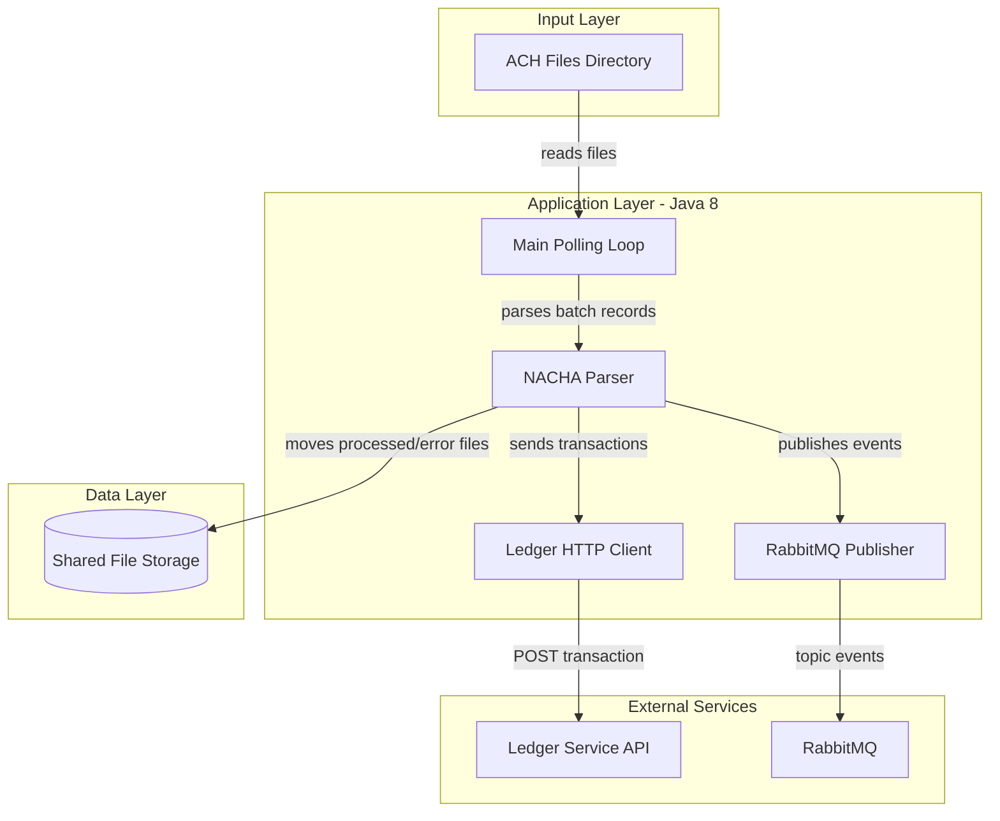
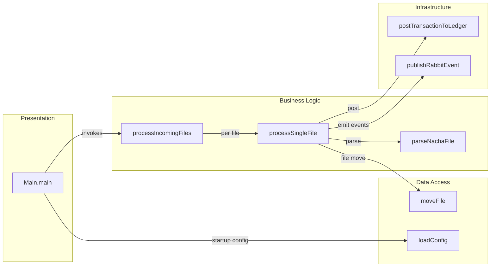

# Architecture Diagram

This application is a single-process Java ACH file processor that polls a shared filesystem, posts transactions to a ledger API, and emits processing events to RabbitMQ.

## Application Architecture

### Technology Stack Summary

| Layer | Technology | Version | Purpose |
|---|---|---|---|
| Runtime | Java | 1.8 | Executes ACH processor loop |
| Build | Gradle | N/A | Build and packaging |
| Messaging | RabbitMQ Java Client | 5.21.0 | Publishes processed and failure events |
| Integration | HttpURLConnection | JDK | Posts ACH transactions to ledger service |
| Storage | Shared filesystem | N/A | Input queue and processed/error file movement |

### Data Storage & External Services

The processor reads ACH files from a configured filesystem path and moves them into processed or error folders after execution. It depends on a downstream ledger HTTP API for transaction posting and RabbitMQ exchanges for publishing processing outcomes.

### Key Architectural Decisions

- Uses a simple polling loop instead of a server framework.
- Keeps state in files and in-memory structures rather than a local database.
- Uses direct HTTP and RabbitMQ client integrations with configuration-driven endpoints.

## Component Relationships

### Component Inventory

| Component | Layer | Type | Responsibility |
|---|---|---|---|
| Main.main | Presentation | Entrypoint | Starts loop, loads config, handles shutdown |
| processIncomingFiles | Business Logic | Orchestrator | Scans input directory and dispatches files |
| processSingleFile | Business Logic | Workflow handler | Parses file, posts entries, determines success/failure path |
| parseNachaFile | Business Logic | Parser | Converts NACHA records into in-memory batch entries |
| postTransactionToLedger | Infrastructure | HTTP adapter | Sends transaction payloads to ledger endpoint |
| publishRabbitEvent | Infrastructure | Messaging adapter | Publishes processed/failure events to RabbitMQ |
| moveFile | Data Access | File adapter | Moves files to processed or error locations |
| loadConfig | Data Access | Config loader | Reads properties and environment overrides |
