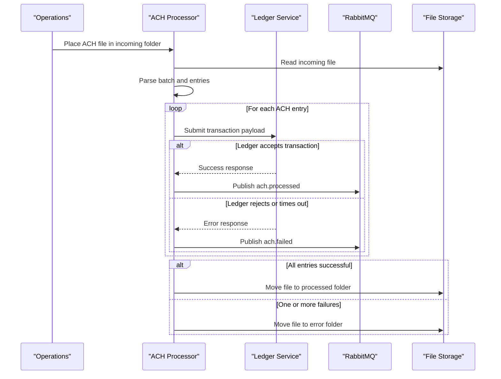

# Core Business Workflows

The application processes ACH files into ledger transactions and emits completion/failure events that downstream banking workflows can consume.

## Domain Entities

| Entity | Service / Bounded Context | Description | Key Relationships |
|---|---|---|---|
| ACH Batch | ACH Processing | Represents a parsed NACHA batch header/control context | Contains many ACH Entries |
| ACH Entry | ACH Processing | Represents one transaction record to post to ledger | Belongs to ACH Batch; drives ledger posting and event publication |
| Processing Outcome | ACH Processing | Represents success/failure state for each file and transaction set | Determines file routing and failure event generation |

## Service-to-Domain Mapping

| Service | Domain Context | Owned Entities | External Dependencies |
|---|---|---|---|
| mnm-ZavaACHProcessor | ACH Processing | ACH Batch, ACH Entry, Processing Outcome | Ledger API, RabbitMQ, shared filesystem |

## Primary Workflows

### Workflow 1: ACH File Intake and Transaction Posting

1. Processor polls the incoming directory and selects a file.
2. File is parsed into batch and entry records.
3. Each entry is posted to the ledger service.
4. Successful entries emit `ach.processed` events.
5. If all entries succeed, file is moved to processed.

### Workflow 2: Failure Handling and Recovery Routing

1. Parse failures immediately mark file as errored.
2. Transaction posting failures increment fail count.
3. Any failed entry triggers `ach.failed` event emission.
4. File is moved to error directory for operational follow-up.

## Cross-Service Data Flows

The processor reads structured payment data from filesystem input, transforms each entry into ledger API payloads, and emits lifecycle events to RabbitMQ. Ledger service failures degrade workflow outcome by moving the whole file to error state after partial processing attempts.

## Business Workflow Sequence

## Business Rules & Decision Logic

- A file is considered successful only when all contained entries post successfully.
- Parse failure is terminal for the file and immediately routes it to error handling.
- Processing emits domain events (`ach.processed`, `ach.failed`) to notify downstream systems.
- File movement to processed/error directories is the authoritative processing state transition.
