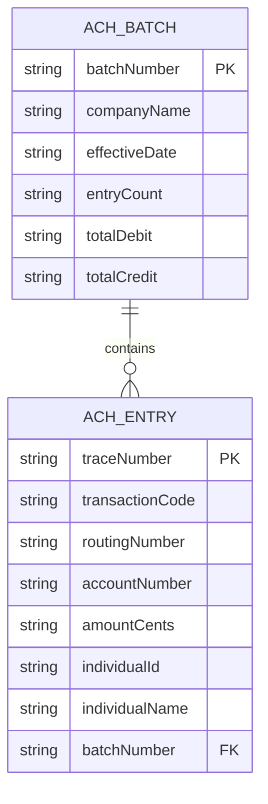

# Data Architecture & Persistence Layer

The data layer is file- and payload-driven, with ACH records parsed into in-memory structures and sent to external systems without local database persistence.

## Database Configuration

| Service/Module | DB Type | Profile | Driver | Connection | Migration Tool |
|---|---|---|---|---|---|
| mnm-ZavaACHProcessor | None local | default | SQL Server JDBC (declared dependency) | None configured in properties | None detected |

## Data Ownership per Service

| Service | Tables Owned | ORM Framework | Caching | Notes |
|---|---|---|---|---|
| mnm-ZavaACHProcessor | None | None | None | Uses `AchBatch` and `AchEntry` in-memory models only |

## Entity Model

## Key Repository Methods

| Service | Repository | Notable Methods | Purpose |
|---|---|---|---|
| mnm-ZavaACHProcessor | None | N/A | No repository interfaces; file parsing and HTTP dispatch only |

## Caching Strategy

No cache provider or cache annotations were detected. Processing is stateless per polling cycle and derives data directly from input files.

## Data Ownership Boundaries

Data is transient inside the processor and authoritative storage is external (ledger system and RabbitMQ consumers). The processor does not directly query external databases and does not maintain shared tables.

### Data Classification & Sensitivity

| Entity | Sensitive Fields | Classification (PII/PHI/PCI/None) | Controls in Place |
|---|---|---|---|
| ACH_ENTRY | accountNumber, individualId, individualName, routingNumber | PII | No field-level masking or encryption controls detected in code |
| ACH_BATCH | companyName | PII | No explicit controls detected |
