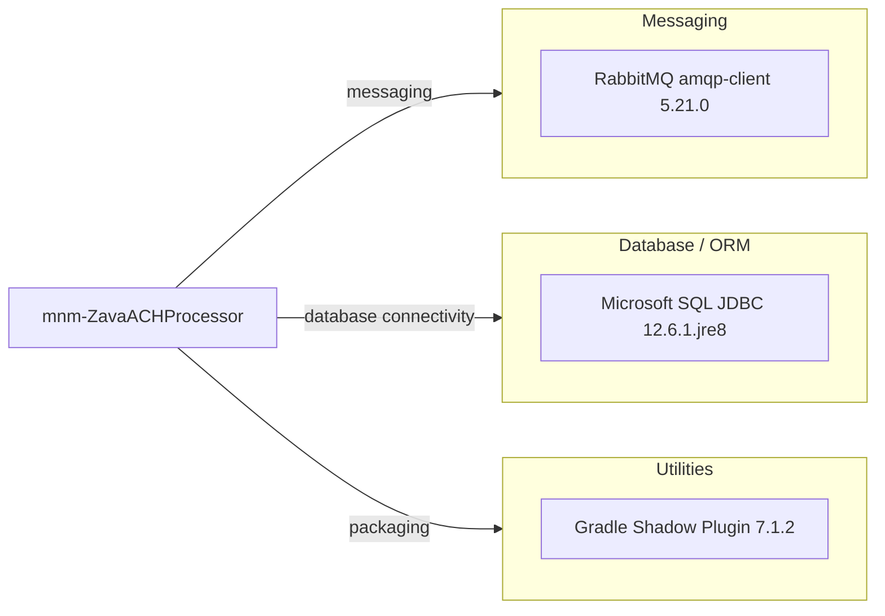

# Dependency Map

The project declares a small dependency set centered on messaging and SQL driver support, with most runtime capabilities provided by the Java standard library.

## Dependencies

### Dependency Summary

| Category | Count | Key Libraries | Notes |
|---|---:|---|---|
| Messaging | 1 | com.rabbitmq:amqp-client | Used to publish ACH processing events |
| Database / ORM | 1 | com.microsoft.sqlserver:mssql-jdbc | Declared JDBC driver dependency |
| Utilities | 1 | com.github.johnrengelman.shadow | Fat-jar packaging plugin |

### Version & Compatibility Risks

The build targets Java 8 while modernization targets typically require newer LTS runtimes. The SQL Server driver variant is explicitly tied to `jre8`, which may require replacement when upgrading the runtime.

### Notable Observations

- Dependency surface is intentionally minimal and integration-focused.
- No web framework or ORM dependency is declared.
- RabbitMQ client is the primary third-party runtime library.

## Test Dependencies

| Framework | Version | Notes |
|---|---|---|
| None detected | N/A | No test-scoped dependencies declared in `build.gradle` |

Total test-scope dependencies: 0
No test infrastructure dependencies were detected in the build file.
